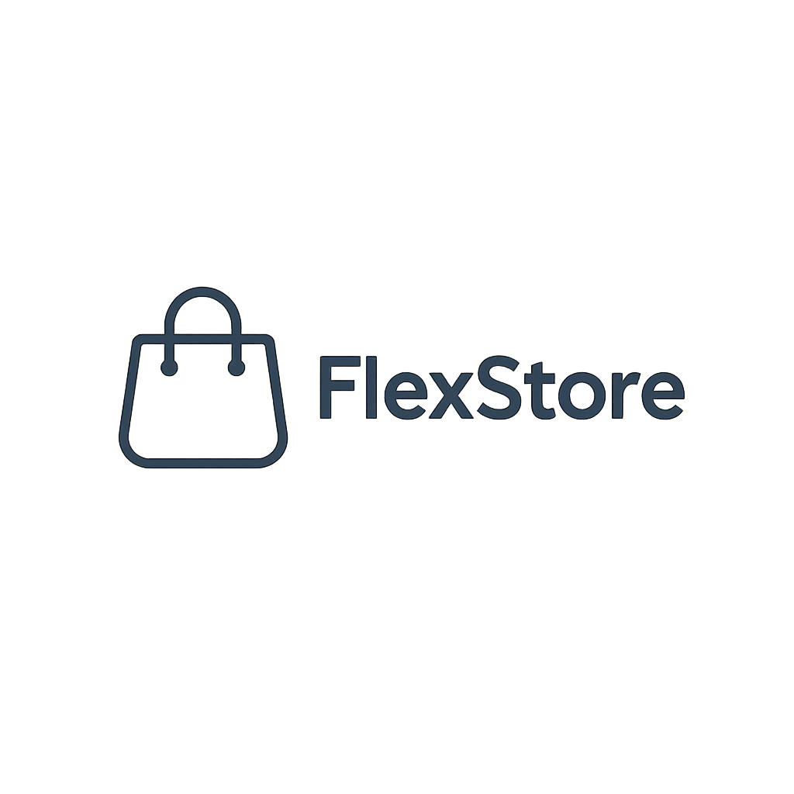

# FlexStore



FlexStore is a full-stack boilerplate for building small business platforms.  
It includes:

- 🌐 Customer-facing site (e.g. souvenir shop, local store)
- 🛠️ Back Office admin panel
- 🧠 Headless CMS (Strapi, Directus, etc.)
- 🗄️ PostgreSQL database and API backend

---

## 🧭 Project Structure

```bash
FlexStore/
├── apps/
│   ├── frontend/      # Customer-facing site
│   ├── backoffice/    # Admin dashboard for internal staff
│   └── cms/           # Headless CMS (optional)
├── server/            # Node.js API server (REST or GraphQL)
├── db/                # Migrations, seeds, schema
├── public/            # Assets like logo, favicons
├── docker-compose.yml # Local dev environment
└── README.md

```

🎯 Why Monorepo?
Easy to build and manage multiple related projects in a single repository.
Later we will build microservices for each app.
